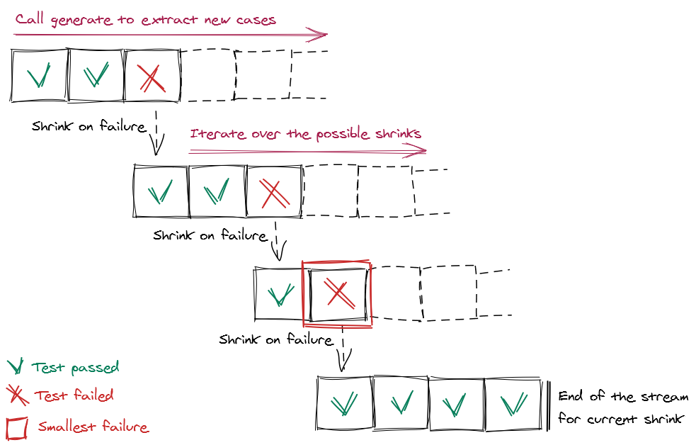

# [:house:](../README.md) How it works?

Let's take a deep dive into how property based testing frameworks work behind the scene.
Understanding how to implement a simple one should give you a better knowledge of fast-check and its internals.

In this document we will describe how to build a property based testing framework (with limited functionalities) from scratch. Our home-made property based testing framework will be called `miniFc` and will rely on `pure-rand` to generate random values. It should help into understanding the big picture.

Once fully introduced, the document will cover the limitations it has and how fast-check dealt with them.

## Table of contents

- [Generators](#generators)
- [Runner](#runner)
- [Shrinkers](#shrinkers)
- [Runner with shrink](#runner-with-shrink)
- [Arbitraries](#arbitraries)
- [Bias](#bias)

## Generators

In property based testing everything starts with generators. Generators take a random number generator and build anything out of it.

You can see generators as follow:

```ts
type Generator<T> = {
    generate(mrng: Random): T;
}
```

In the signature above `mrng` is a mutable random generator. It is a simple wrapper around `pure-rand` that provides a usable random instance. The class `Random` can be implemented as follow:

```js
class Random {
    constructor(rng) {
        this.rng = rng;
    }
    next(min, max) {
        const g = prand.uniformIntDistribution(min, max, this.rng);
        this.rng = g[1];
        return g[0];
    }
}

// Can be used as follow:
// > const prand = require('pure-rand');
// > const seed = 0;
// > const mrng = new Random(prand.xoroshiro128plus(seed));
// > mrng.next(0, 50); // generate a random value between 0 (incl.) and 50 (incl.)
// >                   // using a uniform districution, all values have the same probability
```

For the moment, let's focus on generators. We will discuss later why pure random generators can be useful when doing property based testing.

Let's build our first generator: the one responsible to build random integers.

```js
// const miniFc = {}

miniFc.integer = (min, max) => {
    return {
        generate(mrng) {
            return mrng.next(min, max);
        }
    };
}
// It can be used as follow:
// > miniFc.integer(0, 50).generate(mrng)
```

Our random integer `Generator` is simply returning the value forged by the passed random number generator.

But we want to go further as generators should be able to generate not only integers, they are supposed to generate barely any kind of values. In fast-check, for instance, you can generate numbers, strings, arrays but also objects, functions, recursive structures and also infinite streams of any kind of stuff. In order to produce so many different kind of values without copying the same code again and again, they rely on taking root structures and deriving them into more complex ones as described below:


Let's first consider `boolean` and `character`.
In the diagram above they are constructed out of `integer` generator.
In order to do so, we need to introduce an extra function: `map`.
It will take an existing generator and a mapping function and create another generator out of it:

```ts
declare function map<T, U>(g: Generator<T>, mapper: (v: T) => U): Generator<U>;
```

It can be implemented as follow:

```js
function map(g, mapper) {
    return {
        generate(mrng) {
            const value = g.generate(mrng);
            return mapper(value);
        }
    };
}
```

Now that we have `map` we can implement some of our missing generators:

```js
miniFc.boolean = () => map(
    miniFc.integer(0, 1),
    Boolean
)

miniFc.character = () => map(
    miniFc.integer(0, 25),
    n => String.fromCharCode(97 + n)
)
```

In order to build others, we first need to implement a generator for tuples and a generator for arrays:

```js
miniFc.tuple = (...itemGenerators) => {
    return {
        generate(mrng) {
            return itemGenerators.map(g => g.generate(mrng));
        }
    };
}
// It can be used as follow:
// > miniFc.tuple(miniFc.integer(0, 50), miniFc.boolean()).generate(mrng)

miniFc.array = (itemGenerator) => {
    return {
        generate(mrng) {
            const size = mrng.next(0, 10);
            const content = [];
            for (let index = 0 ; index !== size ; ++index) {
                content.push(itemGenerator.generate(mrng));
            }
            return content;
        }
    };
}
// It can be used as follow:
// > miniFc.array(miniFc.character()).generate(mrng)
```

Now we can build our last generators:

```js
miniFc.string = () => map(
    miniFc.array(miniFc.character()),
    characters => characters.join('')
)

miniFc.dictionary = (valueGenerator) => map(
    miniFc.array(
        miniFc.tuple(
            miniFc.string(),
            valueGenerator
        )
    ),
    Object.fromEntries
)
```

## Runner

It is pretty cool to have generators to generate anything but we need to use them. In order to use them in our small framework, we will define what fast-check calls runners.

In fast-check there is one main runner called `fc.assert`.

But first let define what is a property. We will define it as a super generator for simplicity:

```ts
type Property<T> = {
    generate(mrng: Random): T;
    run(valueUnderTest: T): boolean;
}
```

Properties will be created using the following helper:

```js
miniFc.property = (generator, predicate) => {
    return {
        generate(mrng) {
            return generator.generate(mrng);
        },
        run(valueUnderTest) {
            return predicate(valueUnderTest);
        }
    }
}
```

Now, let's consider a simple example to understand how we want to use our minimal version of fast-check. The code under test will be an implementation of `isSubstring` with obviously a bug into it in order to check that our framework can find it. As a user we would like to be able to write:

```js
const isSubstring = (pattern, text) => {
    return text.indexOf(pattern) > 0;
}

miniFc.assert(
    miniFc.property(
        miniFc.tuple(miniFc.string(), miniFc.string(), miniFc.string()),
        ([a, b, c]) => isSubstring(b, a + b + c)
    )
)
```

In terms of typings we have the following signature to fulfill:

```ts
declare function assert<T>(property: Property<T>): void;
```

By default, in most of the frameworks, runners run the property a hundred times and stop if everything is working fine after those hundred runs.

A basic implementation for the runner can be written as follow:

```js
miniFc.assert = property => {
    for (let runId = 0 ; runId !== 100 ; ++runId) {
        const seed = runId;
        const mrng = new Random(prand.xoroshiro128plus(seed));
        const valueUnderTest = property.generate(mrng);
        if (!property.run(valueUnderTest)) {
            throw new Error(`Property failed after ${runId + 1} runs with value ${JSON.stringify(valueUnderTest)}`);
        }
    }
}
```

Additionally in property based testing, seed is supposed not to be fixed except if specified on call-site. Implementation above can be updated as follow:

```js
miniFc.assert = (property, { seed = Date.now() } = {}) => {
    let rng = prand.xoroshiro128plus(seed);
    for (let runId = 0 ; runId !== 100 ; ++runId) {
        const valueUnderTest = property.generate(new Random(rng));
        if (!property.run(valueUnderTest)) {
            throw new Error(`Property failed after ${runId + 1} runs with value ${JSON.stringify(valueUnderTest)} (seed: ${seed})`);
        }
        rng = rng.jump();
    }
}
```

In previous section, we did not cover the reason why we opted for pure random generators. In property based we want properties to be reproducible no matter the seed, no matter the hardware and no matter the time... But we also want to have independant runs for each iteration in the loop.

For instance, in the implementation defined above, we call generate with the following instances of `Random`:
- `runId = 0` - Call with `new Random(prand.xoroshiro128plus(seed))`
- `runId = 1` - Call with `new Random(prand.xoroshiro128plus(seed)).jump()`
- `runId = 2` - Call with `new Random(prand.xoroshiro128plus(seed)).jump().jump()`
- ...

In few words: `jump` offsets a random number generator, in the context of `xoroshiro128plus` calling `jump` is equivalent to 2^64 calls to `next`. In the case of `pure-rand` neither `jump` nor `next` alter the original instance, they both create a new instance of the generator while keeping the original one unchanged.

No matter how many times our property will call the passed mutable random generator, we will always ignore it to build the generator required for the next iteration. While it might appear strange at first glance, this feature is important as we don't really know what will happen to this instance of our random generator. Among the possible scenarii:

- relying on the offset applied by the property to the passed instance of `Random` is problematic as it makes replays difficult to implement except if we re-generate all the values one-by-one whenever replaying stuff
- instance of `Random` might be kept and re-used later by the property and its `Generator` (we will see that it might be the case in some implementations of shrink), thus calls to generate in subsequent iterations might alter it

We can now use our small framework on the property we discussed earlier in this section. As we were expecting, it finds an issue and reports it. When running it locally you should have an ouput similar to:

```
Property failed after 11 runs with value ["","w","vmethwd"] (seed: 42)
```

## Shrinkers

While our small framework already detect some bugs, it still misses one important feature of property based testing frameworks: shrinking.

Indeed, in such frameworks, whenever a failure occur it will try to reduce it to something smaller so that the end-suer only has to cope with a very simple and small input. I'd say that it helps developers focusing on the real cause without having to manually investigate several potential source of bugs.

For instance: If our `isSubstring` reported an error like: `["", "null$¤¤", "\\undefined.NaN"]`. We may have investigate potentially useless source of bugs.

Before designing complex shrinkers let's see how they integrate themselves in our current design.
First we need to adapt the `Generator` type.

```ts
type Generator<T> = {
    generate(mrng: Random): T;
    shrink(value: T): IterableIterator<T>;
}
```

As you can see in the snippet above, we added a method called `shrink` onto our `Generator` type. This method takes a value - _that have been generated by this `Generator`_ and builds a stream of potential shrinks for this value.

In other words, if I take back our generator of integers, I'd expect the following:
```js
const arb = miniFc.integer(0, 100);
abr.shrink(64) // potential output: 32, 16, 8, 4, 2, 1, 0
```

For integers, the implementation will use a classical technic used in programming: dichotomy. Given the technic we want to use we can adapt the code for `integers` as follow:

```js
miniFc.integer = (min, max) => {
    return {
        generate(mrng) {
            return mrng.next(min, max);
        },
        *shrink(value) {
            while (value !== min) {
                value = min + Math.floor((value - min) / 2);
                yield value;
            }
        }
    }
}
// You can check the output by calling:
// > [...miniFc.integer(0, 100).shrink(64)]
// > [...miniFc.integer(0, 100).shrink(48)]
```

Let's now consider our next root generators: the one for tuples and the one for arrays.

As tuples is simpler let's consider it first. As described in the diagram below a possible way to implement shrink on tuples is to shrink on the first item only, then on the second one only and so on and so forth.


While it does not cover all the possible smaller combinations it should be good enough while keeping a great convergence speed. It can be implemented as follow:

```js
miniFc.tuple = (...itemGenerators) => {
    return {
        generate(mrng) {
            return itemGenerators.map(g => g.generate(mrng));
        },
        *shrink(value) {
            for (let index = 0 ; index !== itemGenerators.length ; ++index) {
                const currentGenerator = itemGenerators[index];
                const currentValue = value[index];
                for (const shrunkValue of currentGenerator.shrink(currentValue)) {
                    yield [...value.slice(0, index), shrunkValue, ...value.slice(index + 1)];
                }
            }
        }
    }
}
// You can check the output by calling:
// > [...miniFc.tuple(miniFc.integer(0, 100), miniFc.integer(0, 100), miniFc.integer(0, 100)).shrink([4, 3, 4])]
```

Concerning arrays, the algorithm needs to shrink on two dimensions:
- the size of the array
- the content of the array

When impacting the size, it should not only cover the cases in which we keep the N first items. It should also consider cases in which last item is required to reproduce the failure while the first ones can be partially removed.

For instance, if we consider an algorithm that fails whenever an array contains twice the same item. If it first failed on `[4, 1, 2, 1, 3]` shrinker will have to be able to remove one item at the beginning, one at the middle and one at the end in order to converge towards the minimal case `[1, 1]`.

Shrinking strategy on arrays is divided into three different steps.

1. As most of the time, smaller arrays are simpler to understand, the first step will focus on reducing the size of the array and preserving only the N last items
2. As for tuples, arrays are made of values and shrinking them might also simplify investigations. The second step shrink the first element and concatenate it to the remaining ones (not impacted).
3. We keep the first item as is and apply recursively 1. and 2. on the tail of the array.

Let's apply this logic onto our example `[4, 1, 2, 1, 3]`:
- `[2, 1, 3]` (due to 1.)
- `[1, 2, 1, 3]` (due to 1.)
- `[2, 1, 2, 1, 3]` (due to 2.)
- `[1, 1, 2, 1, 3]` (due to 2.)
- `[0, 1, 2, 1, 3]` (due to 2.)
- `[4, 1, 3]` = `[4] :: [1, 3]` (due to 3.1.)
- `[4, 2, 1, 3]` = `[4] :: [2, 1, 3]` (due to 3.1.)
- `[4, 0, 2, 1, 3]` = `[4] :: [0, 2, 1, 3]` (due to 3.2.)
- ...

We can adapt our implementation of array to to support shrinking as follow:

```js
miniFc.array = (itemGenerator) => {
    return {
        generate(mrng) {
            const size = mrng.next(0, 10);
            const content = [];
            for (let index = 0 ; index !== size ; ++index) {
                content.push(itemGenerator.generate(mrng));
            }
            return content;
        },
        *shrink(value) {
            // No shrink on empty arrays
            if (value.length === 0) {
                return;
            }
            // Step 1. Shrink on size first by keeping last items
            let removedSize = Math.floor(value.length / 2);
            while (removedSize > 0) {
                yield value.slice(removedSize);
                removedSize = Math.floor(removedSize / 2);
            }
            // Step 2. Shrink the first item alone
            for (const shrunkItemValue of itemGenerator.shrink(value[0])) {
                yield [shrunkItemValue, ...value.slice(1)];
            }
            // Step 3. Keep first item untouched
            for (const shrunkValue of this.shrink(value.slice(1))) {
                yield [value[0], ...shrunkValue];
            }
        }
    }
}
// You can check the output by calling:
// > [...miniFc.array(miniFc.integer(0, 100)).shrink([4, 1, 2, 1, 3])]
```

Now that all our root generators have been covered let's adapt the generators based on them. When defined those derived generators we introduced a `map` function to help us in our task.

Generator for characters has been defined as follow:
```js
miniFc.character = () => map(
    miniFc.integer(0, 25),
    n => String.fromCharCode(97 + n)
)
```

As it generates `string` (of a single character), shrinker will consume `string` and produce smaller `string`. But how can `map` know how to convert the `string` received as input of the shrinker to passe it the shrinker of mapped generator (or `miniFc.integer(0, 25)` in our case)?

Actually if we wanted to define the shrinker function for `miniFc.character` we would have written something like:
```js
const shrinker = (character) => {
    const derivedGenerator = miniFc.integer(0, 25);
    const initialValue = character.codePointAt(0) - 97;
    for (const shrunkValue of derivedGenerator.shrink(initialValue)) {
        yield String.fromCharCode(97 + shrunkValue);
    }
}
```

In other words, it means that mapping a generator to derive it requires the user to declare two helper functions:
- one to map - _eg.: from integer to character in our example_
- another one to unmap - _eg.: from character to integer in our example_

With that in mind, `map` can be changed into:

```js
const map = (g, mapper, unmapper) => {
    return {
        generate(mrng) {
            return mapper(g.generate(mrng));
        },
        *shrink(value) {
            for (const shrunkValue of g.shrink(unmapper(value))) {
                yield mapper(shrunkValue);
            }
        }
    };
};
```

And all our derived generators can be adapted to add support for shrink:

```js
miniFc.boolean = () => map(
    miniFc.integer(0, 1),
    Boolean,
    b => b ? 1 : 0,
)
miniFc.character = () => map(
    miniFc.integer(0, 25),
    n => String.fromCharCode(97 + n),
    c => c.codePointAt(0) - 97,
)
miniFc.string = () => map(
    miniFc.array(miniFc.character()),
    characters => characters.join(''),
    s => s.split('')
)
miniFc.dictionary = (valueGenerator) => map(
    miniFc.array(miniFc.tuple(miniFc.string(), valueGenerator)),
    Object.fromEntries,
    Object.entries,
)

// > [...miniFc.boolean().shrink(true)]
// > [...miniFc.character().shrink("h")]
// > [...miniFc.string().shrink("hello")]
// > [...miniFc.dictionary(miniFc.string()).shrink({"hello": "world"})]
```

## Runner with shrink

At this point, our runner is not using shrinker capabilities we introduced in previous part.

Shrinkers have been introduced in an attempt to find the smallest failing case.
They achieve one main purpose: given one value they compute strictly smaller ones.

From a runner perspective, in order to get the smallest possible failing case we want to shrink as soon as we find an issue.
So we generate values and run the predicate on it and as soon as we find an issue we take this value and shrint it.
Moreover while iterating over those shrunk entries we might find another one that will fail, we shrink it and iterate over it until we cannot find smaller bugs.

The process is summarized into the diagram below:



In terms of code, we can adapt our `miniFc.assert` as follow:

```js
miniFc.property = (generator, predicate) => {
    return {
        generate(mrng) {
            return generator.generate(mrng);
        },
        shrink(value) {
            return generator.shrink(value);
        },
        run(valueUnderTest) {
            return predicate(valueUnderTest);
        }
    }
}

function executeAndShrink(valueUnderTest, property) {
    if (!property.run(valueUnderTest)) {
        for (const shrunkValue of property.shrink(valueUnderTest)) {
            const shrunkResults = executeAndShrink(shrunkValue, property);
            if (shrunkResults.failed) {
                return shrunkResults;
            }
        }
        return { failed: true, value: valueUnderTest };
    }
    return { failed: false };
}

miniFc.assert = (property, { seed = Date.now() } = {}) => {
    let rng = prand.xoroshiro128plus(seed);
    for (let runId = 0 ; runId !== 100 ; ++runId) {
        const valueUnderTest = property.generate(new Random(rng));
        const testResults = executeAndShrink(valueUnderTest, property);
        if (testResults.failed) {
            throw new Error(`Property failed after ${runId + 1} runs with value ${JSON.stringify(testResults.value)} (seed: ${seed})`);
        }
        rng = rng.jump();
    }
}
```

Here we are, our home-made property based framework is now able to generate values, run tests and find failures, and in case of failure to shrink it towards something smaller to help our users.

But unfortunately this design was not solid enough...

## Arbitraries

While our current shape for `Generator` seems to be able to deal with many kind of values it implies two major difficulties:

- the `map` function requires a `mapper` and a `rmapper` otherwise it cannot shrink on generated values
- some arbitraries such as `oneof` are barely impossible to write correctly

Indeed, if you think a little bit about implementing `oneof` with current design while preserving shrinking capabilities you may struggle a bit. `oneof` could be used used as follow by users:

```js
miniFc.oneof(
    miniFc.string(),
    miniFc.boolean(),
) // produces either a string or a boolean
```

First, `oneof` would be at the same level as `integer`, `tuple` and `array` but it would not be enough.

How do you shrink a `oneof`? When receiving the value in `shrink(value)` how do you know which one of the passed arbitraries generated the value? For instance, if I call `shrink` with `"abc"` in the generator defined above how can it know that it should use `miniFc.string().shrink` and not `miniFc.boolean().shrink`.

For that reason, some frameworks do not offer shrinking capabilities on `oneof` or if they do they ask for really complex definitions. So how is fast-check doing?

In the past, fast-check used the `Generator` type described in previous sections but has never published any versions using it (see commit [e679f1e0](https://github.com/dubzzz/fast-check/commit/e679f1e018ac29e5b5731e1c30a32a407be2d0cc)). While the `Generator` type offers a great mental model, limitations on shrinking capabilities makes it difficult to use as soon as you want to provide a tool able to generate and shrink on any kind of data.

So fast-check introduced the notion of `Shrinkable` and `Arbitrary`. An `Arbitrary` is more or less the `Generator` we discussed before except that it generates `Shrinkable`. A `Shrinkable` is holding a value and knows how to shrink it. It answers to the question we asked ourselves before: _How do you know which one of the passed arbitraries generated the value?_.

```ts
type Arbitrary<T> = {
    generate(mrng: Random): Shrinkable<T>;
}
type Shrinkable<T> = {
    value: T;
    shrink(): IterableIterator<Shrinkable<T>>;
}
```

## Bias
