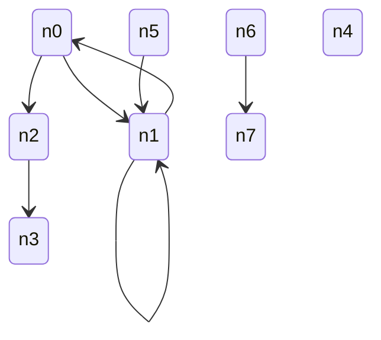
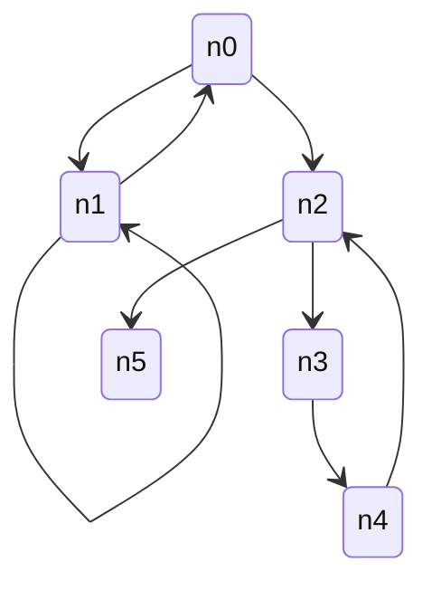
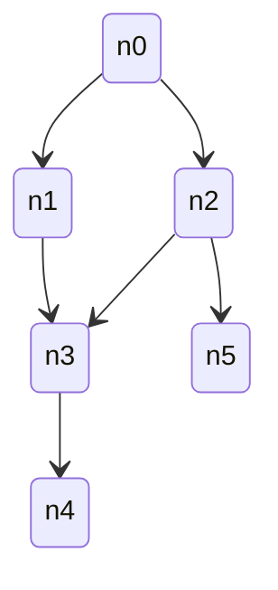

Relational structures are among the hardest to generate. They not only need the entity data to be properly defined but also its links to refer to existing entities with some constraints being fulfilled. This new minor of fast-check brings to you a built-in helper that makes you able to describe your schema and get relationally linked entities out of it. It may be relevant to push fast-check further than just simple unit tests by providing primitives to build way more complex structures.

Continue reading to explore the detailed updates it brings.

<!--truncate-->

## Why supporting relation structures

Many higher level algorithms have to deal with data having cross-links. As such is your algorithm wants to deal with an organigram of employees chances are that you will want employees to have a single manager and manager not to be managed even transitively by one of their managees. Before this release building such structure was doable but required a bit of hard work to glue everything together and get your wonderful organigram. Among the various problems of building manually was that it was easy to make it wrong and thus your test was somehow something to be tested too.

With this release we bring relational schemas as a first class citizen in fast-check. We believe that such helper would prove useful for many extended usages of the library. As such it may help users to extend property based testing paradigm to a broader class of problems making it a non optional option whenever having to test a piece of code.

## Examples backed by `entityGraph`

### Graph

A graph is nothing more than a relational structure with nodes being connected to each others. Using `entityGraph` we can easily come up with graphs. The arbitrary could be leveraged to build the structure `{ node: Node[] }` with `Node` being:

```ts
type Node = {
  id: string; // each node has its own id, no duplicated ids
  linkTo: Node[];
};
```

We can consider that we are ok with set of nodes that might be totally unrelated, that might have cycles, that might have self-reference... Here is an example of such set:



If we are good with that kind of graph, the declaration would consist of:

```ts
fc.entityGraph(
  { node: { id: fc.uuid() } },
  { node: { linkTo: { arity: 'many', type: 'node' } } },
  { unicityConstraints: { node: (value) => value.id } },
);
```

That said in many cases you will probably want to bring more constraints to your nodes. As an example you may come with the need to only have nodes being connected to each others. With fast-check you can easily create a graph with a node able to link you to all others either directly or transitively.

Such set of nodes could possibly be:



To ask for it to us, you'd have to update your declaration as follows:

```ts
fc.entityGraph(
  { node: { id: fc.uuid() } },
  { node: { linkTo: { arity: 'many', type: 'node' } } },
  {
    initialPoolConstraints: { node: { maxLength: 1 } }, // <-- line added
    unicityConstraints: { node: (value) => value.id },
  },
);
```

With that configuration all nodes will be accessible from the first node in the array of nodes.

But from time to time constraints might be even higher. Some users may want to build directed acyclic graph also refered as DAG. Such structure would forbid cycles to exist and can bring some extra details to your test to make more asumptions on the output.

Here is an example of such graph:



To be coded with:

```ts
fc.entityGraph(
  { node: { id: fc.uuid() } },
  { node: { linkTo: { arity: 'many', type: 'node' } } },
  {
    initialPoolConstraints: { node: { maxLength: 1, strategy: 'successor' } }, // <-- line changed
    unicityConstraints: { node: (value) => value.id },
  },
);
```

## Changelog since 4.4.0

The version 4.5.0 is based on version 4.4.0.

### Features

- ([PR#6333](https://github.com/dubzzz/fast-check/pull/6333)) Add `entityGraph` for schema-based structures
- ([PR#6336](https://github.com/dubzzz/fast-check/pull/6336)) Take into account the depth in `entityGraph`
- ([PR#6340](https://github.com/dubzzz/fast-check/pull/6340)) Add initial pool constraints to `entityGraph`
- ([PR#6341](https://github.com/dubzzz/fast-check/pull/6341)) Add strategies to `entityGraph`
- ([PR#6342](https://github.com/dubzzz/fast-check/pull/6342)) Allow recursions on many rels for `entityGraph`
- ([PR#6343](https://github.com/dubzzz/fast-check/pull/6343)) Tweak unicity of entities produced by `entityGraph`
- ([PR#6400](https://github.com/dubzzz/fast-check/pull/6400)) Support inverse relations in `entityGraph`

### Fixes

- ([PR#6375](https://github.com/dubzzz/fast-check/pull/6375)) Bug: Fix workflow authentication by enabling credential persistence
- ([PR#6369](https://github.com/dubzzz/fast-check/pull/6369)) CI: Fix vulnerabilities in our GitHub workflows
- ([PR#6370](https://github.com/dubzzz/fast-check/pull/6370)) CI: Add workflow security audit with zizmor
- ([PR#6374](https://github.com/dubzzz/fast-check/pull/6374)) CI: Fix vulnerabilities in build-status workflow
- ([PR#6397](https://github.com/dubzzz/fast-check/pull/6397)) CI: Ignore trusted publishing for pkg-pr-new
- ([PR#6410](https://github.com/dubzzz/fast-check/pull/6410)) CI: Fix generate-changelog script
- ([PR#6365](https://github.com/dubzzz/fast-check/pull/6365)) Doc: Release note for version 4.4.0
- ([PR#6379](https://github.com/dubzzz/fast-check/pull/6379)) Doc: Fix dead links in the documentation
- ([PR#6378](https://github.com/dubzzz/fast-check/pull/6378)) Doc: Connect AskAI in docsearch from Algolia
- ([PR#6380](https://github.com/dubzzz/fast-check/pull/6380)) Doc: Update Content-Security-Policy for AskAI
- ([PR#6367](https://github.com/dubzzz/fast-check/pull/6367)) Doc: Rework JSDoc for entityGraph and related types
- ([PR#6383](https://github.com/dubzzz/fast-check/pull/6383)) Doc: Enhance `entityGraph` documentation
- ([PR#6337](https://github.com/dubzzz/fast-check/pull/6337)) Refactor: Allocate unlinked versions earlier in `entityGraph`
- ([PR#6339](https://github.com/dubzzz/fast-check/pull/6339)) Refactor: Split code of `entityGraph` into sub-helpers
- ([PR#6345](https://github.com/dubzzz/fast-check/pull/6345)) Refactor: Import all files with an extension
- ([PR#6398](https://github.com/dubzzz/fast-check/pull/6398)) Script: Ask AIs to be concise when naming PRs
- ([PR#6389](https://github.com/dubzzz/fast-check/pull/6389)) Test: Replace @ts-ignore with @ts-expect-error
