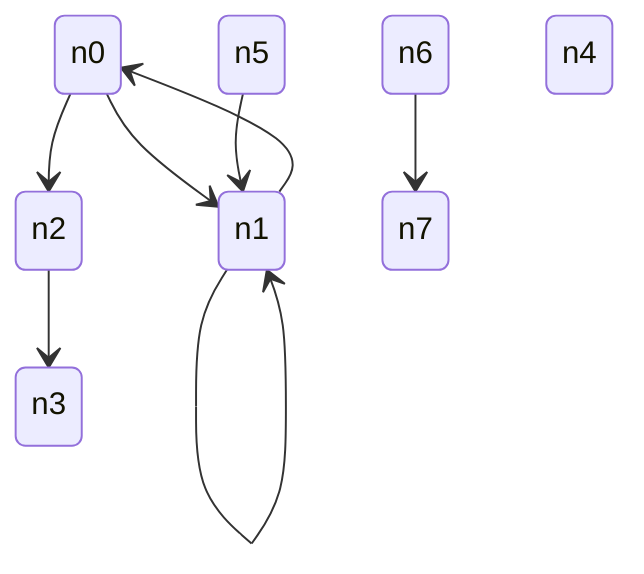
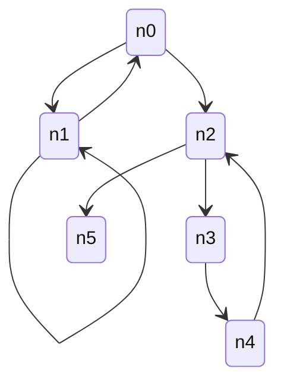
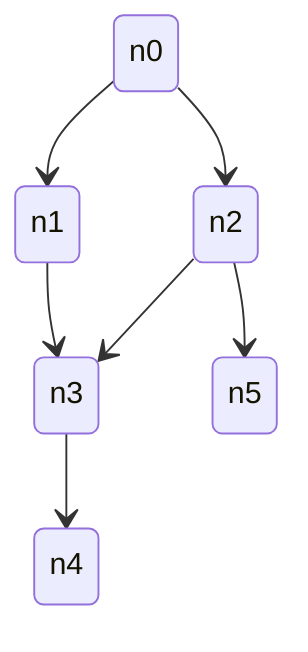

Relational structures are among the hardest kinds of data to generate. Not only do entities need to be well-defined, but their links must also point to existing entities while satisfying a set of constraints. This release introduces a built-in helper that lets you describe your schema to generate properly linked relational data from it.

With this release, we aim to go beyond simple unit-level data and offers primitives to build significantly more complex inputs. This should make it easier to extend your usage of property-based testing further. Why not trying it against higher-level algorithms?

Continue reading to explore the detailed updates it brings.

<!--truncate-->

## Why support relational structures?

Many higher-level algorithms operate on data with cross-links. For instance, if your algorithm works with an organizational chart of employees, you probably want each employee to have a single manager and do not want a manager to be managed by one of their subordinates even transitively.

Without `entityGraph`, building such structures requires a fair amount of code. That code was often tricky to get right and mistakes could easily slip in. As a result, the test code itself sometimes became something that needed to be tested.

With `entityGraph`, relational schemas become first-class citizens. We believe this helper will prove useful for many advanced use cases and will help extend the property-based testing paradigm to a broader class of problems.

## Examples backed by `entityGraph`

### Graph

A graph is nothing more than a relational structure with nodes being connected to one another. With `entityGraph`, we can easily generate graphs. For example, we will show how to use it to produce values of the shape `{ node: Node[] }`, with `Node` defined as:

```ts
type Node = {
  id: string; // each node has its own id, no duplicated ids
  linkTo: Node[];
};
```

Let’s start with a very permissive definition. We will allow nodes to be totally unrelated, to form cycles, or even to reference themselves. A possible generated graph could look like this:



To describe such graphs, you can write:

```ts
fc.entityGraph(
  { node: { id: fc.uuid() } },
  { node: { linkTo: { arity: 'many', type: 'node' } } },
  { unicityConstraints: { node: (value) => value.id } },
);
```

That said in many cases you will probably want to bring more constraints to your nodes. As an example you may come with the need to only have nodes being connected to each others. With fast-check you can easily create a graph with a node able to link you to all others either directly or transitively.

Such set of nodes could possibly be:



To ask for it to us, you'd have to update your declaration as follows:

```ts
fc.entityGraph(
  { node: { id: fc.uuid() } },
  { node: { linkTo: { arity: 'many', type: 'node' } } },
  {
    initialPoolConstraints: { node: { maxLength: 1 } }, // <-- line added
    unicityConstraints: { node: (value) => value.id },
  },
);
```

With that configuration all nodes will be accessible from the first node in the array of nodes.

But from time to time constraints might be even higher. Some users may want to build directed acyclic graph also refered as DAG. Such structure would forbid cycles to exist and can bring some extra details to your test to make more asumptions on the output.

Here is an example of such graph:



To be coded with:

```ts
fc.entityGraph(
  { node: { id: fc.uuid() } },
  { node: { linkTo: { arity: 'many', type: 'node' } } },
  {
    initialPoolConstraints: { node: { maxLength: 1, strategy: 'successor' } }, // <-- line changed
    unicityConstraints: { node: (value) => value.id },
  },
);
```

todo add back links linkFrom

## Changelog since 4.4.0

The version 4.5.0 is based on version 4.4.0.

### Features

- ([PR#6333](https://github.com/dubzzz/fast-check/pull/6333)) Add `entityGraph` for schema-based structures
- ([PR#6336](https://github.com/dubzzz/fast-check/pull/6336)) Take into account the depth in `entityGraph`
- ([PR#6340](https://github.com/dubzzz/fast-check/pull/6340)) Add initial pool constraints to `entityGraph`
- ([PR#6341](https://github.com/dubzzz/fast-check/pull/6341)) Add strategies to `entityGraph`
- ([PR#6342](https://github.com/dubzzz/fast-check/pull/6342)) Allow recursions on many rels for `entityGraph`
- ([PR#6343](https://github.com/dubzzz/fast-check/pull/6343)) Tweak unicity of entities produced by `entityGraph`
- ([PR#6400](https://github.com/dubzzz/fast-check/pull/6400)) Support inverse relations in `entityGraph`

### Fixes

- ([PR#6375](https://github.com/dubzzz/fast-check/pull/6375)) Bug: Fix workflow authentication by enabling credential persistence
- ([PR#6369](https://github.com/dubzzz/fast-check/pull/6369)) CI: Fix vulnerabilities in our GitHub workflows
- ([PR#6370](https://github.com/dubzzz/fast-check/pull/6370)) CI: Add workflow security audit with zizmor
- ([PR#6374](https://github.com/dubzzz/fast-check/pull/6374)) CI: Fix vulnerabilities in build-status workflow
- ([PR#6397](https://github.com/dubzzz/fast-check/pull/6397)) CI: Ignore trusted publishing for pkg-pr-new
- ([PR#6410](https://github.com/dubzzz/fast-check/pull/6410)) CI: Fix generate-changelog script
- ([PR#6365](https://github.com/dubzzz/fast-check/pull/6365)) Doc: Release note for version 4.4.0
- ([PR#6379](https://github.com/dubzzz/fast-check/pull/6379)) Doc: Fix dead links in the documentation
- ([PR#6378](https://github.com/dubzzz/fast-check/pull/6378)) Doc: Connect AskAI in docsearch from Algolia
- ([PR#6380](https://github.com/dubzzz/fast-check/pull/6380)) Doc: Update Content-Security-Policy for AskAI
- ([PR#6367](https://github.com/dubzzz/fast-check/pull/6367)) Doc: Rework JSDoc for entityGraph and related types
- ([PR#6383](https://github.com/dubzzz/fast-check/pull/6383)) Doc: Enhance `entityGraph` documentation
- ([PR#6337](https://github.com/dubzzz/fast-check/pull/6337)) Refactor: Allocate unlinked versions earlier in `entityGraph`
- ([PR#6339](https://github.com/dubzzz/fast-check/pull/6339)) Refactor: Split code of `entityGraph` into sub-helpers
- ([PR#6345](https://github.com/dubzzz/fast-check/pull/6345)) Refactor: Import all files with an extension
- ([PR#6398](https://github.com/dubzzz/fast-check/pull/6398)) Script: Ask AIs to be concise when naming PRs
- ([PR#6389](https://github.com/dubzzz/fast-check/pull/6389)) Test: Replace @ts-ignore with @ts-expect-error
